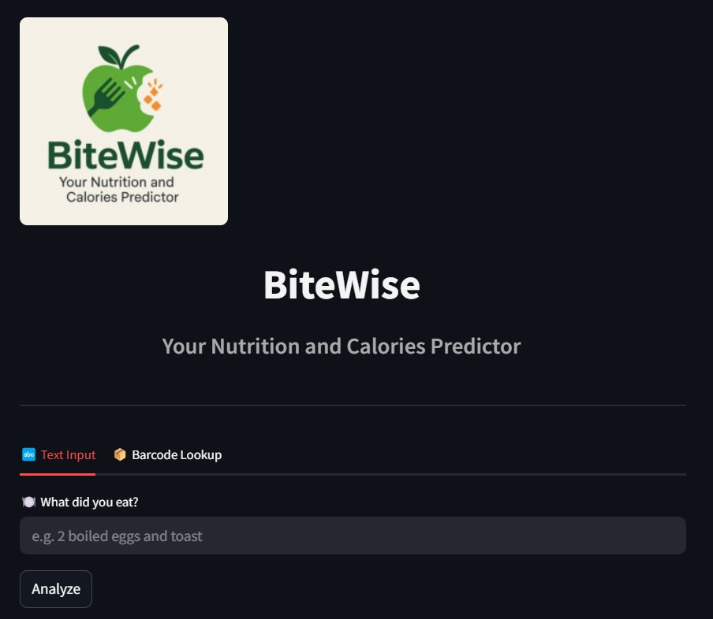
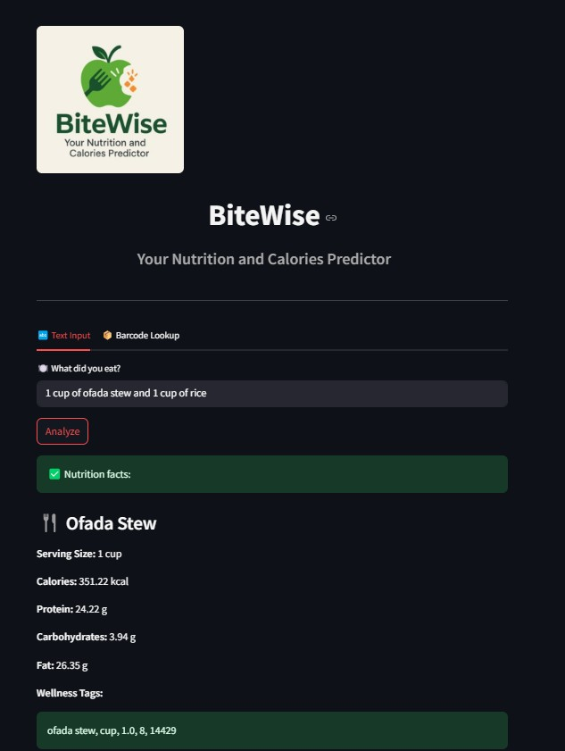
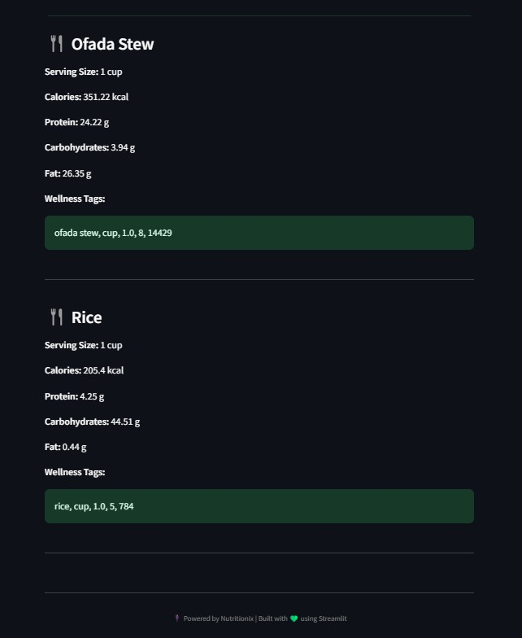

# 🥗 BiteWise - Your Nutrition and Calories Predictor

**BiteWise** is a simple yet powerful web application that allows users to analyze meals or food items using natural language input or barcode lookup. It provides instant nutritional information such as calories, macronutrients, and wellness tags using the Nutritionix API.

---

## 🌟 Features

- 🔤 **Text input** – Type what you ate (e.g., _“2 boiled eggs and toast”_)
- 📦 **Barcode scanner** – Enter UPC barcodes from packaged foods
- ⚡ **Live nutrition analysis** – Calories, protein, carbs, fat, serving size
- 🏷️ **Wellness tags** – Like “keto”, “high protein”, “low fat” (if available)
- 🌙 **Dark mode theme** – Clean UI optimized for nighttime viewing
- 🖼️ **Custom logo & branding** – Includes BiteWise logo and layout

---
## 📸 Demo Screenshot




---

## 🌐 Live Demo (Try it yourself!)

👉 [🔗 Click here to open the Streamlit app](https://adeyemibolaji-bitewise-app-app-3yu4r8.streamlit.app/)

✅ You can test different car combinations and see the predicted price instantly!

---
## 📁 Project Structure

```bash
BiteWise/
│
├── app.py
├── requirements.txt
├── bitewise_logo.png
├── .env              # (excluded from Git)
├── .gitignore
└── .streamlit/
    └── config.toml   # dark mode theme
```
## 🚀 Getting Started

### 1. Clone the repository

```bash
git clone https://github.com/your-username/BiteWise.git
cd BiteWise
```
### 2. Install dependencies
I recommend using a virtual environment:
```bash
pip install -r requirements.txt
``` 
### 3. Create your .env file
Create a .env file with your Nutritionix API keys:
```bash
NUTRITIONIX_APP_ID=your_app_id
NUTRITIONIX_API_KEY=your_api_key

``` 
⚠️ Do not share this file. It is already excluded via .gitignore.

### 4. Run the app
```bash
streamlit run app.py


```

### 5. Deploy to Streamlit Cloud

- Push this repo to GitHub

- Go to https://streamlit.io/cloud

- Connect your repo and deploy app.py

- Add your API keys to the Secrets section:
```bash
NUTRITIONIX_APP_ID=your_app_id
NUTRITIONIX_API_KEY=your_api_key
```

### 6. 🧾 Example Inputs
- “1 cup of oatmeal with milk and banana”

- “Grilled chicken sandwich and fries”

- Barcode: 04963406


### 7. 🙌 Acknowledgments
- Nutritionix API

- Streamlit